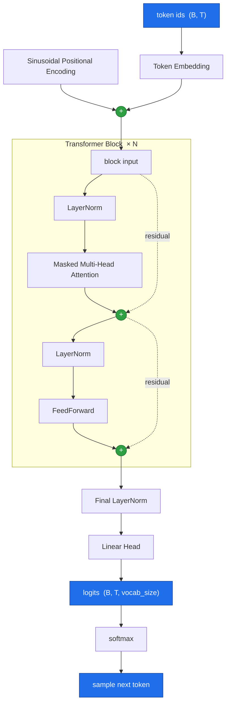

# Decoder-Only Transformer Model from Scratch (PyTorch)
Building a minimal **decoder-only transformer** using PyTorch, a ground up implementation. Core components: sinusoidal positional encoding, masked multi-head self-attention, position-wise feed-forward layers, and pre-norm residual blocks. All core components built by hand using classes that extend `nn.Module` rather than using `torch.nn.Transformer`, with the goal of developing a deeper more intuitive understanding of underlying logic and foundational components that make up the architecture. 

## Highlights
- Pure PyTorch, no high-level transformer abstractions.
- Explicit attention math, causal masking, and residual wiring.
- Use of **pre-norm** blocks, **scaled dot-product attention**, GELU feed-forward, and GPT-2 style weight initialization.
- Trains on a standard **next-token prediction** objective, every position in a sequence contributes to the loss in a single forward pass.
- Autoregressive text generation with **temperature** and **top-k** sampling.
- Configuration-driven architecture via a single `Config` dataclass.

## Architecture
Data flows from token IDs to probability distribution over the vocabulary:

| Module | Responsibility |
| ------ | -------------- |
| `PositionalEncoding` | Fixed sinusoidal position signal added to the token embeddings so the attention layers can reason about order. |
| `MultiHeadAttention` | Masked causal multi-head self-attention, each position attends to only itself and previous positions. |
| `PosWiseFeedForward` | Two-Layer MLP (`n_embd -> 4*n_embd -> n_embd`) with GELU, applied identically at every position. |
| `Block` | One pre-norm transformer block: `x = x + attn(ln1(x))` then `x = x + ffn(ln2(x))`. |
| `Transformer` | Assembles the embeddings, block stack, final norm, and output head. Computes the training loss and defines the generation loop. |

## Model configuration
Architecture is defined by the Config dataclass. 

