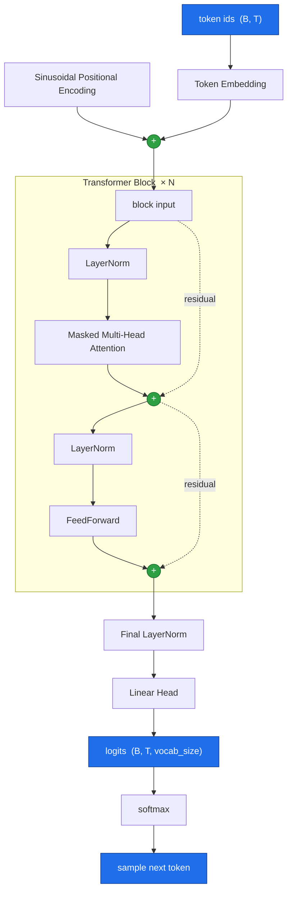
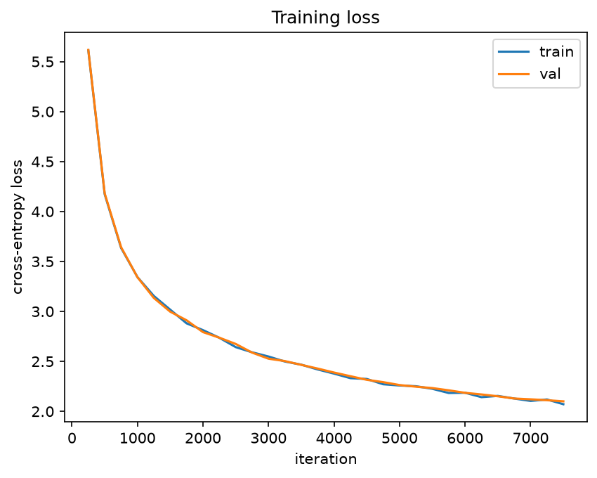

# Decoder-Only Transformer Model from Scratch (PyTorch)
Building a minimal **decoder-only transformer** using PyTorch, a ground up implementation. Trained on the TinyStories dataset. Core components: sinusoidal positional encoding, masked multi-head self-attention, position-wise feed-forward layers, and pre-norm residual blocks. All core components built by hand using classes that extend `nn.Module` rather than using `torch.nn.Transformer`, with the goal of developing a deeper more intuitive understanding of underlying logic and foundational components that make up the architecture. 

Default configuration is a ~16.95M parameter model that learns to generate short, coherent children's stories.

## Highlights
- Pure PyTorch, no high-level transformer abstractions.
- Explicit attention math, causal masking, and residual wiring.
- Use of **pre-norm** blocks, **scaled dot-product attention**, GELU feed-forward, and GPT-2 style weight initialization.
- Trains on a standard **next-token prediction** objective, every position in a sequence contributes to the loss in a single forward pass.
- Autoregressive text generation with **temperature** and **top-k** sampling.
- Configuration-driven architecture via a single `Config` dataclass.
- Runs on laptop, small vocab (8k) and model width keeps it trainable on modest hardware.
- Training uses bf16 autocast automatically when CUDA GPU is available.

## Repo structure
    .
    ├── data_prep.py     # download TinyStories, train BPE tokenizer, write token .bin files + get_batch()
    ├── model.py         # Config dataclass + all model classes
    ├── train.py         # training loop, evaluation, checkpointing
    ├── generate.py      # load a checkpoint and sample stories interactively
    └── data/tinystories/
        ├── tokenizer.json   # trained byte-level BPE tokenizer
        ├── train.bin        # training token ids (flat uint16)
        ├── val.bin          # validation token ids (flat uint16)
        └── meta.pkl         # vocab_size, eot_id, token counts, tokenizer path

## Architecture
Data flows from token IDs to probability distribution over the vocabulary:

Shape convention: `B` = batch, `T` = sequence length, `C` = `n_embd`, `V` = `vocab_size`.

| Module | Responsibility |
| ------ | -------------- |
| `PositionalEncoding` | Fixed sinusoidal position signal added to the token embeddings so the attention layers can reason about order. |
| `MultiHeadAttention` | Masked causal multi-head self-attention, each position attends to only itself and previous positions. |
| `PosWiseFeedForward` | Two-Layer MLP (`n_embd -> 4*n_embd -> n_embd`) with GELU, applied identically at every position. |
| `Block` | One pre-norm transformer block: `x = x + attn(ln1(x))` then `x = x + ffn(ln2(x))`. |
| `Transformer` | Assembles the embeddings, block stack, final norm, and output head. Computes the training loss and defines the generation loop. |

## Model configuration
Architecture is defined by the Config dataclass. 

| Field | Meaning | Example |
| -- | -- | -- |
| `vocab_size` | Size of token vocabulary | 8192 |
| `block_size` | Maximum context length | 256 |
| `n_embd` | Residual-stream width | 384 |
| `n_head` | Number of attention heads | 6 |
| `n_layer` | Number of transformer blocks | 6 |
| `dropout` | Dropout probability | 0.1 |

These settings produce a model **~16.95M parameters**. Only `vocab_size` and `block_size` need to stay in sync with the data pipeline.

## Data pipeline
`data_prep.py` handles everything upstream of the model:
- Downloads TinyStories via Hugging Face datasets library.
- Trains a **Byte-level BPE tokenizer** with an 8192 token vocabulary and an `<|endoftext|>` separator, saved to `tokenizer.json`.
- Encodes each split, appends `<|endoftext|>` after every story, and streams the IDs to flat `uint16` binary files (`train.bin`, `val.bin`). One story batch at a time so memory stays bounded.
- Writes `meta.pkl` (vocab_size, end-of-text id, token counts, tokenizer path).
- Exposes `get_batch(split, block_size, batch_size, device)`, which memory-maps the `.bin` file and returns an `(x, y)` minibatch where `y` is `x` shifted by one position to the left for expected next-token-prediction.
    
## Installation
    git clone https://github.com/Juleswalker0510/Transformer_from_Scratch.git
    cd Transformer_from_Scratch
    pip install torch datasets tokenizers numpy

## Usage
### 1. Prepare data (run once)
    python data_prep.py
Downloads the dataset, trains tokenizer, writes token `.bin` files and metadata into `data/tinystories`.

### 2. Train
    python train.py
Reads `vocab_size` from `meta.pkl`, trains the model, prints train/val loss at each eval interval, saves checkpoint to `ckpt.pt` (model weights, config, metadata). A short sample is printed at the end.

### 3. Generate
    python generate.py
Loads `ckpt.pt` and prompts for input, sampling a story from each prompt. Press enter for default "Once upon a time", or type `exit` to quit.

To generate from your own code:

    import torch
    from model import Transformer, Config
    
    # (load config + weights from ckpt.pt as in generate.py)
    context = torch.tensor([tokenizer.encode("Once upon a time").ids])
    tokens = model.generate(context, max_new_tokens=200, temperature=0.8, top_k=200)
    print(tokenizer.decode(tokens[0].tolist()))

`temperature` controls randomness (lower = more focused, higher = more diverse) and 
`top_k` restricts sampling to the k most likely tokens at each step.

## Training setup
| Setting | Value |
| ------- | ----- |
| Optimizer | AdamW |
| Learning rate | 3e-4 |
| Batch size | 32 |
| Context length | 256 |
| Iterations | 7500 |
| Precision | fp32, with bf16 autocast on CUDA |
| Eval | mean loss over 50 batches every 500 steps |

## Results

Trained for 7,500 iterations on TinyStories. Final metrics:

| Metric | Value |
| ------ | ----- |
| Parameters | 16.95M |
| Train loss | 2.07 |
| Val loss | 2.10 |
| Val perplexity | 8.17 |
| Hardware | single NVIDIA GeForce RTX 4060 (8 GB) |
| Training time | ~15mins |

### Loss curve

### Sample output
Prompt: _"Once upon a time"_ (temperature = 0.8, top_k = 200):

> Once upon a time, there was a little girl named Lily. She loved to play with her toys and sing    songs. One day, her mommy said it was time to be dinner. Lily was very excited!
>
>Lily's mommy said it was time for bed. Lily was sad because she didn't want to eat dinner. She  asked her mommy if she could help her. Her mommy said yes, but Lily remembered to be more careful  when dinner.
>
>Later that night, Lily's mommy asked her if she needed a treat. Lily said yes and said, "I like  cookies. It's yummy!" Her mommy said, "I am a good helper, Lily." They eat some cookies together  and sat down to eat. The next day, Lily's mommy gave her a big kiss and said, "Thank you for      helping me." Lily felt happy and went to bed feeling happy.

Notes:
- The model produces fluent, grammatical stories with occasional lapses in logical consistency, but consistent with its size.

## Implementation notes
Some design choices
- **Pre-norm blocks**. LayerNorm is applied before each sub-layer, with a residual add outside the norm. This leaves a clean unnormalized gradient from input to output and trains stably at depth. This is the current standard in contrast to post-norm used in the original 2017 paper.
- **Causal masking**. A lower triangular mask blocks each position from attending to future tokens. This makes the model autoregressive and lets all positions be trained as independent next-token predictions in one forward pass.
- **Scaled dot-product attention**. Attention scores are divided by `sqrt(head_dim)` to keep the softmax out of its saturated, low-gradient regime.
- **Weight initialization**. Linear and embedding weights are drawn from `N(0, 0.02)` with zero biases, following GPT-2 convention.

## References
- Vaswani et al., Attention Is All You Need (2017)
- Radford et al., Language Models are Unsupervised Multitask Learners (GPT-2 2019)
- Eldan & Li, TinyStories: How Small Can Language Models Be and Still Speak Coherent English? (2023)
- A. Karpathy, nanoGPT

